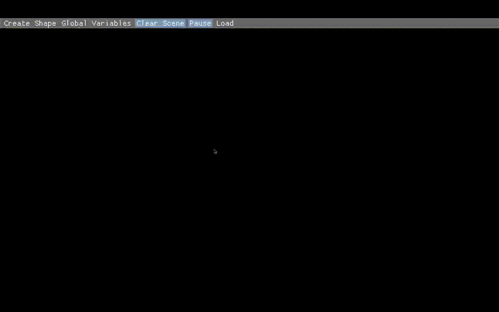
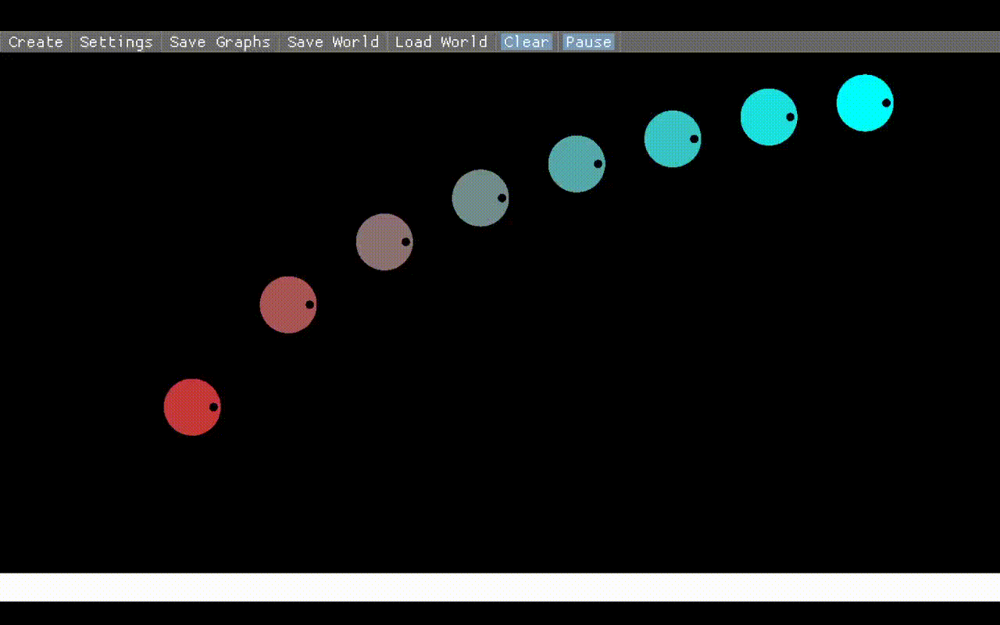

# physics-v2

Educational physics sim that uses graphs, FBDs, and other helpful stuff to teach physics. Also see my [gravity sim](https://github.com/mkhan45/gravity-sim-v2)

## Features

- [X] Basic physics simulation using [nphysics](nphysics.org)
- [X] Basic Lua scripting for saving presets
- [X] Create shapes
- [X] View and modify shape properties such as velocity through a GUI
- [ ] Graph object properties
- [ ] Free body diagrams
- [ ] Convex polygons
- [ ] Ropes
- [ ] Lines

## Controls
- Left click to drag a shape
- Right click to view editable properties of a shape
- B to create a box, C to create a circle
- Use the top bar GUI to 
  - Create shapes
  - Edit global variables
  - Clear the scene
  - Pause
  - Load Lua files
  
## gifs

